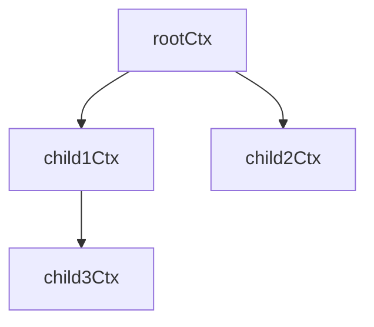

# golang learn about context


https://betterprogramming.pub/understanding-context-in-golang-7f574d9d94e0

## What is Context module?

當客戶端程式想要把對伺服器的連線切斷的時候 gracefully shutdown

透過 Context 機制傳訊息給正在運行的 goroutine 讓 goroutine 做出適當回應

1 監聽 cancel 事件

2 傳送 cancel 事件

3 傳遞請求層級的資料

## Context 介面

```go
type Context interface {
    Done() <- chan struct{}
    Err() error
 
    Deadline() (deadline time.Time, ok bool)
    Value(key interface{}) interface{}
}
```

**Done()** : 當 context 被 cancel 時，會回傳一個 channel 並且會收到一個空 struct

**Err()** : 當 cancel 事件發生錯誤時，會回傳 error 否則 nil


## Err 確認發生錯誤時停止執行

```go
func handler(ctx context.Context) {
    if ctx.Error() != nil {
        fmt.Println("Context is canceled")
        return
    }
    fmt.Println("Processing request")
}
```

## 發送 Cancellation Event

以下有 3 個 Method 可以產生發送 cancellation event 的 callback

```go
func WithCancel(parent Context)(ctx Context, cancel CancelFunc)
func WithTimeout(parent Context, timeout time.Duration)(ctx Context, cancel CancelFunc)
func WithDeadline(parent Context, d time.Time)(ctx Context, cancel CancelFunc)
```

## Context Tree

```go
rootCtx := context.Background()
child1Ctx, cancelFunc1 := context.WithCancel(rootCtx)
child2Ctx, cancelFunc2 := context.WithCancel(rootCtx)
child3Ctx, cancelFunc3 := context.WithCancel(child1Ctx)
```



在這個範例裡，當 cancelFunc1 被呼叫，關聯的 child3Ctx 也會呼叫 cancelFunc3

## RootContext

```go
func Background() Context

func TODO() Context
```

在我們的例子裡，主要的 Context 用來作為所有 Context 的根

用來生成其他 Context

## WithCancel

```go
func handler() {
    ctx := context.Background()
    ctx, cancel := context.WithCancel(ctx)
    
    go operation(ctx)
    
    data, err := databaseQuery()
    if err != nil {
        cancel()
    }
}

func operation(ctx context.Context) {
    for {
        select {
        case <- ctx.Done():
            fmt.Println(ctx.Err().Error())
            return
        default:
            fmt.Println("Do Something")
        }
    }
}
```

上面那段程式碼，當 databaseQuery 出現 Error， cancel 被呼叫，operation 內的 ctx.Done() 就會被觸發

## WithTimeout
```go
func handler() {
    ctx := context.Background()
    
    ctx, cancel := context.WithTimeout(
        ctx,
        3 * time.Second,
    )
    defer cancel()
    
    dataChan := make(chan string)
    go databaseQuery(dataChan)
    
    select {
    case <- dataChan:
        fmt.Println("Query succeeds, do something")
    case <- ctx.Done():
        fmt.Println("Timeout exceeded, returning")
        return
    }
}
```

上面範例程式碼，當執行超過 3 秒，cancel 就會自動執行

所以如果 databaseQuery 超過 3 秒， handler 就會直接結束執行

## WithDeadline

```go
func handler() {
    ctx := context.Background()
    
    ctx, cancel := context.WithDeadline(
        ctx,
        time.Now().Add(time.Second*3)
    )
    
    defer cancel()
}
```

在這個範例，如果超過 3 秒， cancel也會被自動觸發

## 傳遞 Request Scope Data

```go
const traceIDKey = "trace_id"
func main() {
    ctx := context.Background()
    ctx = context.WithValue(
        ctx,
        traceIDKey,
        "random_id123"
    )
    function1(ctx)
}

func function1(ctx context.Context) {
    log.Println(
        "Entered function 1 with traceID:",
        ctx.Value(traceIDKey)
    )
    
    function2(ctx)
}

func function2(ctx context.Context) {
    log.Println(
        "Entered function 2 with traceID:",
        ctx.Value(traceIDKey)
    )
}
```

透過 WithValue 我們可以透過 key value 方式把要傳遞的 Context 傳入多階層呼叫中

## 使用 cancelable function 必須注意的點

### 1 必須要 Defer Cancel function

當使用 WithCancel 生成一個 cancellable context 時，

這個模組會

1 當 cancel 被呼叫時，產生一個新的 gorountine 在背景來傳遞這個 cancelation event 到所有 child context 
2 會紀錄所有 children context 在 parent context 結構

所以如果當一個程式執行完卻沒有做 cancel 這些生成的 context ， 這些 child context 會留存在記憶體內有機會造成 memory leak，因為沒有做好適當的回收。

**Notice** WithTimeout 與 WithDeadline 是例外，因為超過 deadline ，這兩類 context 就會自動呼叫 cancel

### 2 只針對 RequestScope Data 使用 WithValue

```go
ctx := context.Background()

ctx1 := context.WithValue(ctx, "key1", "value1")


ctx1 := context.WithValue(ctx1, "key1", "value2")
```

在上面的範例程式碼，會容易誤解把最後的 key1 取代為 value2，然而並沒有

實際上 WithValue 函式會把 parent context 的值取出來複製一份，回傳那個複製的 key value。

當傳入的 arguments 太多會導致記憶體增加太快。
